---
# No `title:` or `author:`. Either one makes Quarto generate its own title
# slide, and that slide cannot be edited — no image, no fragment, nothing placed
# by hand. Leaving both out means slide 1 is yours; see `## {.cover}` below.
pagetitle: "Huandeng — every feature, working"
date: last-modified
date-format: "D MMMM YYYY"
bibliography: ref.bib
format:
  revealjs:
    footer: "Huandeng &nbsp;·&nbsp; the demo deck"
---

## {.cover}

{.absolute top="24" left="0" width="244px"}

:::: {.cover-inner}

[Every feature, working]{.cover-title}

[A deck that is also the manual for writing one]{.cover-subtitle}

::: {.cover-meta}
**Press → to start, or O for the overview**

Press **X** at any time to see where the slide ends


:::

::::

## Reference

:::: {.columns}

::: {.column}
**Structure**

- `#` section, `##` slide, `---` another slide
- `{.class}` and `{key="value"}` on any heading
- `::: {.class}` … `:::` around any block

**Layout classes**

- `.columns` (50/50), `.columns-2-1`, `.columns-3-2`, `.columns-1-1-1`
- `.fig` + `.caption` / `.credit` / `.below`
- `.media-row` + `.media-label` / `.media-items`
- `.cover` + `.cover-inner` / `-title` / `-subtitle` / `-meta`
- `.card`, `.pill`, `.highlight`, `.alert`
- `.small`, `.tiny`, `.center`, `.muted`
:::

::: {.column}
**Reveal's own**

- `.incremental`, `.fragment`, `. . .`
- `.absolute`, `.r-stack`, `.r-stretch`
- `{auto-animate="true"}` on two slides in a row
- `{background-color=".."}`, `{background-image=".."}`

**Presenting**

- **S** speaker view · **F** fullscreen · **O** overview
- **B** blank · **G** jump to slide · **M** menu · `?` keys
- **X** the 1280 &times; 720 boundary, while you write
- `#/7` in the URL jumps to slide 7
:::

::::

# Getting started

## What this is

**Quarto** renders Markdown to a [reveal.js](https://revealjs.com/)
presentation: a real web page, driven by the arrow keys.

- Version-controls as cleanly as any text file, because it *is* a text file
- The look is SCSS, so anything CSS can do, a slide can do
- Video, animation and live web content work, because it *is* a browser
- Speaker view, a timer and a slide menu come for free

. . .

- …and `. . .` reveals the rest of a slide on the next keypress

::: notes
Speaker notes live in a `::: notes` block beside the slide they belong to. Press
**S** during the talk for the presenter window: notes, a timer, and the next
slide. Nothing load-bearing goes here — reveal hides notes when it prints, so
they reach neither the PDF nor the PPTX.
:::

## A deck is five things

:::: {.columns-2-3}

::: {.column}
::: {.no-header}
| | |
|:-----------------------|:-----------------------------------------------------|
| `talk.qmd` | the slides — normally the only file you touch |
| `_quarto.yml` | size, slide level, theme, footer |
| `themes/` | ten stylesheets; one line picks one |
| `head.html` | the fonts, and the **X** key |
| `attach/` | images and video |
:::
:::

::: {.column}
```bash
cp -r template talks/my-talk
cd talks/my-talk
mv template.qmd talk.qmd
make preview
```

::: {.small .muted}
A browser opens and reloads every time you save. `make preview` needs nothing
but Quarto, so a deck copied anywhere still builds — years from now, on a
machine that has never heard of this repository.
:::
:::

::::

::: {.highlight}
Every deck owns its copies. Nothing is imported from outside its own folder, so
a finished talk never changes under you.
:::

## Ten looks, one line

The theme is one line of `_quarto.yml`, and all ten stylesheets travel inside
every deck — so switching is a text edit, and undo is undo.

```yaml
theme: [default, themes/swiss.scss]
```

:::: {.columns}

::: {.column}
::: {.no-header}
| | |
|:--------------|:--------------------------------|
| `swiss` | black, white, one red — the default |
| `university` | azure on white, the plain one |
| `paper` | a printed journal page |
| `whiteprint` | an engineering drawing |
| `solarized` | low contrast, for a bright room |
:::
:::

::: {.column}
::: {.no-header}
| | |
|:--------------|:--------------------------------|
| `nord` | dark blue-grey, frost accents |
| `blueprint` | deep blue, amber, monospace |
| `signal` | a briefing paper, navy and gold |
| `monochrome` | ivory and black, no colour |
| `cobalt` | squared paper, italic serif |
:::
:::

::::

::: {.caption-line}
`make gallery` renders all ten side by side into `out/gallery.html`, with that
line printed under each — the easy way to choose is to look.
:::

## The one command that matters

An over-full reveal.js slide does not error and does not shrink. The surplus
hangs into the margin and is cut by the window edge, so a slide can look merely
tight on a 16:10 laptop and be cut on a 16:9 projector.

:::: {.columns}

::: {.column}
```bash
make check     # after ANY slide edit
make png       # one PNG per slide, to read
```

- `--check` walks the built deck in a headless browser and reports content past
  any edge
- it also audits every drawn image against its own pixel size and fails a
  figure stretched more than 2%
- exit 1 means look
:::

::: {.column}
::: {.highlight}
Press **X** in any deck to draw the 1280 &times; 720 boundary while you write.
:::

::: {.small .muted}
The boundary is the hard edge: content past it is cut by the window rather than
scaled down. Reveal offers no rescue here — `auto-stretch` is off, and an
over-full slide simply hangs off the side.
:::
:::

::::

## Exporting

:::: {.columns}

::: {.column}
**What you get**

- `out/demo.html` — the deck, assets beside it
- `out/demo-standalone.html` — one file you can email
- `out/demo.pdf` — **one page per step**: the deck as presented
- `out/demo-one-page-per-slide.pdf` — fully built, for reading
- `out/demo.pptx` — one full-bleed image per slide
:::

::: {.column}
**Commands**

```bash
make            # html
make all        # html + pdf + pptx
make standalone
make check
make png
```

::: {.small .muted}
The layout is CSS, so only a browser can render it. The PDF is printed through
reveal's own print layout in headless Chromium, and the PPTX is that PDF
rasterised — a PowerPoint writer cannot read CSS.
:::
:::

::::

## The rules of the file

- **New section** — a `#` heading, which becomes a divider slide
- **New slide** — a `##` heading, set by `slide-level: 2`
- **Another slide, same title** — a bare `---`
- **Deck-wide options** — `_quarto.yml`; this deck's own date and footer, the
  YAML at the top of this file
- **Custom layout** — a class on the heading, or a fenced div in the body

```markdown
## {.cover}
## One big statement {.focus .center background-color="#0a6ebd"}
::: {.columns-2-1} ::: {.column} … ::: ::: {.column} … ::: :::
```

## One big statement {.focus .center background-color="var(--deck-primary)"}

A slide with one thing on it

# Building a slide

## Reveals, one step at a time

:::: {.columns}

::: {.column}
**A list, item by item**

::: {.incremental}
- First this
- then this
- then this.
:::
:::

::: {.column}
**Anything, as a fragment**

::: {.fragment .fade-in}
`.fade-in` — arrives quietly
:::

::: {.fragment .highlight-red}
`.highlight-red` — turns red
:::

::: {.fragment .strike}
`.strike` — gets crossed out
:::
:::

::::

::: {.caption-line}
A fragment costs a keypress and nothing else: it lives inside one slide. Only
the per-step PDF spends a page on it, which is what makes the flip-book later on
survive printing.
:::

## Lists and formatting

:::: {.columns}

::: {.column}
- Ordinary Markdown
  - `**Bold text**` for emphasis
  - `*Italic text*` for subtle emphasis
  - `` `Inline code` `` for technical terms
- `[..]{.alert}` paints text in the theme's accent, like [this]{.alert}
- `[..]{.muted}` steps it back, like [this]{.muted}
:::

::: {.column}
**Nested lists**

- Main point 1
  - Sub-point A
  - Sub-point B
- Main point 2
  - Sub-point C
  - Sub-point D
:::

::::

::: {.highlight}
`::: {.highlight}` is the callout for the one sentence a slide is really about.
:::

## Cards and tags

::::: {.columns-1-1-1}

:::: {.column}
::: {.card}
**Question**

Does the signal spread at a constant rate?

[scope]{.pill}
:::
::::

:::: {.column}
::: {.card}
**Approach**

Track its width over twelve steps, three ways

[method]{.pill}
:::
::::

:::: {.column}
::: {.card}
**Result**

Two methods agree; the third drifts low

[+18%]{.pill}
:::
::::

:::::

`.card` draws a boundary round a group and carries no emphasis of its own;
`.highlight` is the one sentence a slide is about, and says so in colour.
`[..]{.pill}` is an inline tag. Every theme gives all three a different edge.

::: notes
The three cards are a `.columns-1-1-1` of `.card` blocks. Note the fence
lengths: five colons round the row, four round each column, three round each
card. Same-length fences do not nest.
:::

## Do not start a fenced div with a heading

::: {.highlight}
Pandoc writes a div that opens with a heading out as a `<section>`, and reveal's
slide selector is `.slides section` — a descendant selector — so it silently
becomes a slide of its own.
:::

:::: {.columns}

::: {.column}
**Wrong** — three phantom slides

````markdown
::: {.card}
#### Setup
…
:::
````
:::

::: {.column}
**Right** — lead with bold text

````markdown
::: {.card}
**Setup**
…
:::
````
:::

::::

::: {.caption-line}
`.column` is safe, because Quarto rewrites those itself. `make check` catches
the rest — the slide count comes out higher than the number of `##` you wrote.
:::

## Tables

:::: {.columns}

::: {.column}
**With a header row**

| Method | Bias | Cost |
|:-------|:-----|:-----|
| A | none | high |
| B | low | medium |
| C | high | low |
:::

::: {.column}
**Headerless**

::: {.no-header}
| | | |
|---|---|---|
| Step | Width | Error |
| 4 | 2.41 | 0.09 |
| 8 | 4.06 | 0.12 |
| 12 | 5.98 | 0.07 |
:::
:::

::::

`::: {.no-header}` hides the header row, for a table that is really a grid.
Pandoc only assigns column widths when the delimiter row is longer than its
column limit — pad it, and the dash counts become the proportions.

## Code highlighting

```python
def spread_width(field, threshold=0.5):
    """Width of the region above a threshold, in grid units."""
    above = field > threshold
    return above.sum() ** 0.5
```

Fenced blocks are highlighted by Quarto at render time, with no JavaScript
involved. Each stylesheet colours the syntax tokens from its own palette, so
there is no second setting to keep in step with the theme.

## Code that walks itself

Give the fence a `code-line-numbers` and each keypress moves the highlight:

```` markdown
``` {.python code-line-numbers="1-2|4|6"}
```
````

``` {.python code-line-numbers="1-2|4|6"}
def compute(x, y):
    z = x + y

    result = z * 2

    return result
```

## Blockquotes and links

> The best way to predict the future is to invent it.
>
> <cite>Alan Kay</cite>

- [Quarto](https://quarto.org/)
- [Quarto reveal.js presentations](https://quarto.org/docs/presentations/revealjs/)
- [reveal.js](https://revealjs.com/)

# Figures

## One figure with a source credit

Every figure in a talk needs to say where it came from. `.fig` shrink-wraps the
image, so the credit sits tight against the image's own bottom-right corner
rather than the slide's.

:::: {.columns}

::: {.column}
````markdown
::: {.fig}
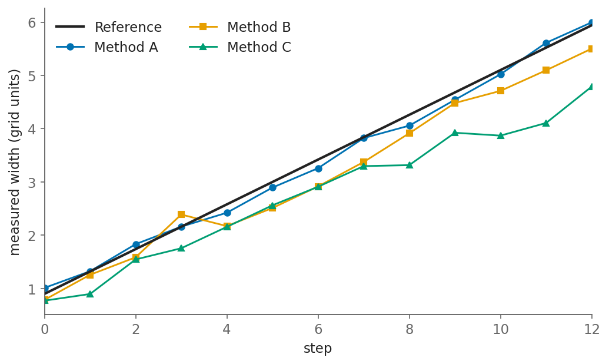{width="300px"}

[Author 2026]{.credit}
:::
````

[Size images inside `.fig` in `px` or `pt`. A percentage has nothing to resolve
against inside a box that is sizing itself to its contents.]{.small .muted}
:::

::: {.column}
::: {.fig}
{width="440px"}

[Author 2026]{.credit}
:::
:::

::::

## Caption above, a label below, or both

`.caption` goes above the figure — the house default, since a slide is read top
to bottom. `.below` is the exception, for the second half of a paired label.
Both are optional, and so is the credit.

:::: {.columns-1-1-1}

::: {.column}
::: {.fig}
[Above the figure]{.caption}

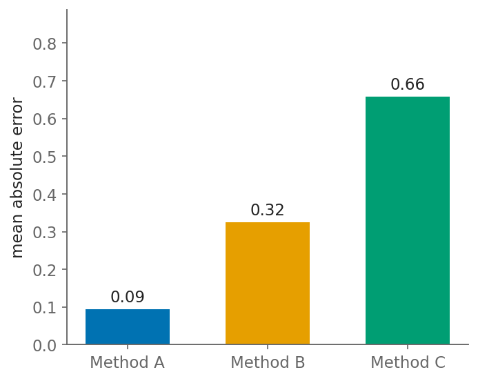{width="230px"}

[Author 2026]{.credit}
:::
:::

::: {.column}
::: {.fig}
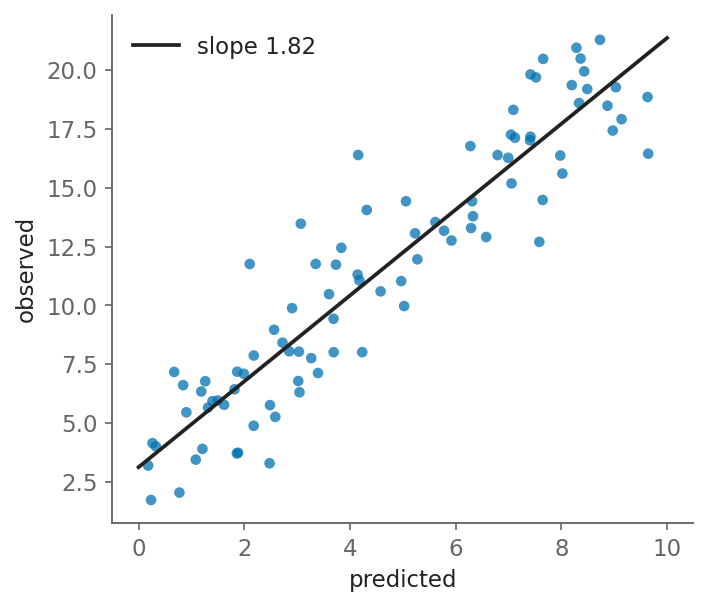{width="230px"}

[Author 2026]{.credit}

[Below the figure]{.below}
:::
:::

::: {.column}
::: {.fig}
[Step 4]{.caption}

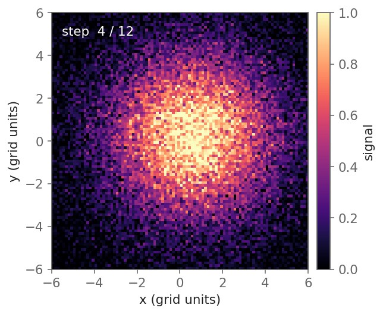{width="230px"}

[Author 2026]{.credit}

[Step 12]{.below}
:::
:::

::::

## A row of figures

:::: {.media-row}
::: {.media-label}
Early:
:::
::: {.media-items}
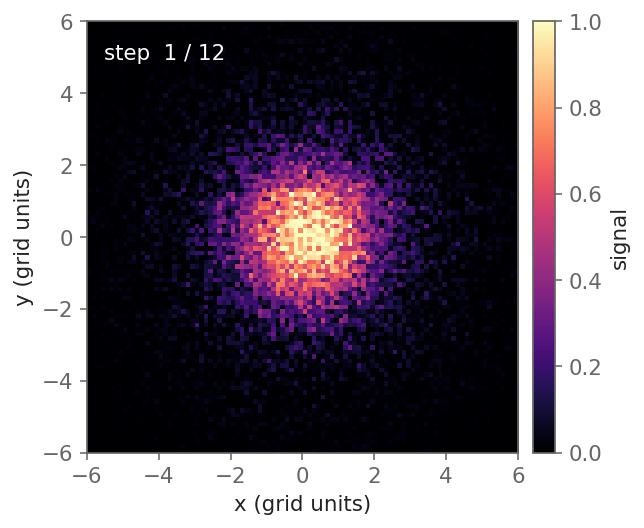{width="215px"} 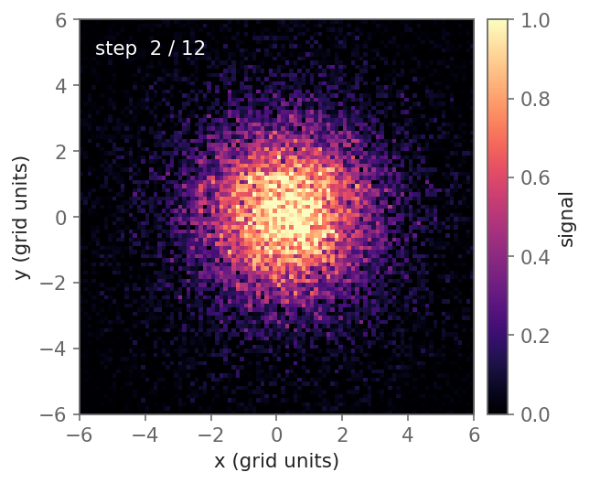{width="215px"} 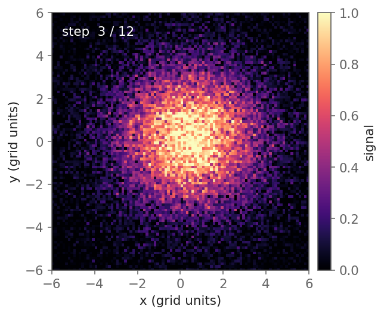{width="215px"}
:::
::::

<!-- 300 and 379 are 644 and 814 — the two files' own pixel widths — at one
     common scale factor, so the pair fills the row and still shows the two
     figures at their true size relative to each other. -->
:::: {.media-row}
::: {.media-label}
Two sizes:
:::
::: {.media-items}
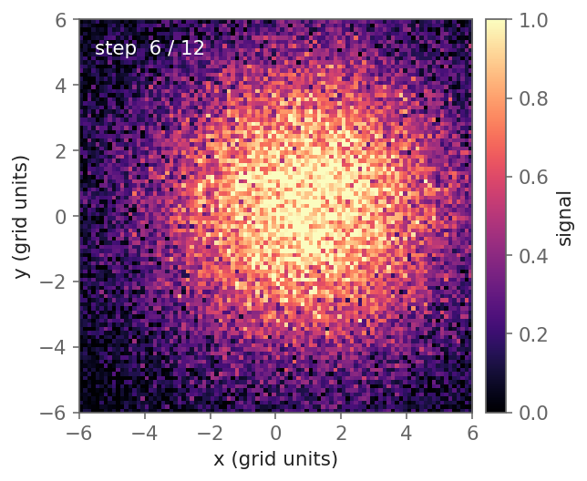{width="230px"} {width="290px"}
:::
::::

::: {.caption-line}
A width or a height, never both — `make check` fails any figure drawn more than
2% off its file's own shape.
:::

## Figure beside text

:::: {.columns-3-2}

::: {.column}
Other tools dock a background image and let text float over it. Here you compose
the slide instead:

- `::: {.columns-3-2}` splits the page
- the image is an ordinary Markdown image in the right column
- any ratio works: `.columns-1-1`, `.columns-2-1`, `.columns-1-1-1`

The figure takes part in the layout rather than floating behind it, so text
never collides with it.
:::

::: {.column}
{width="330px"}
:::

::::

## A grid of figures

::::::: {style="--label-width: 170px"}

:::: {.media-row}
::: {.media-label}
Method A:
:::
::: {.media-items}
{width="215px"} 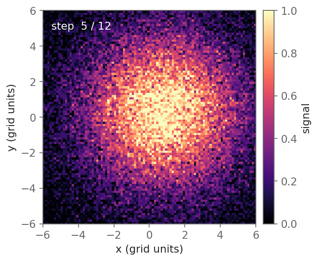{width="215px"} 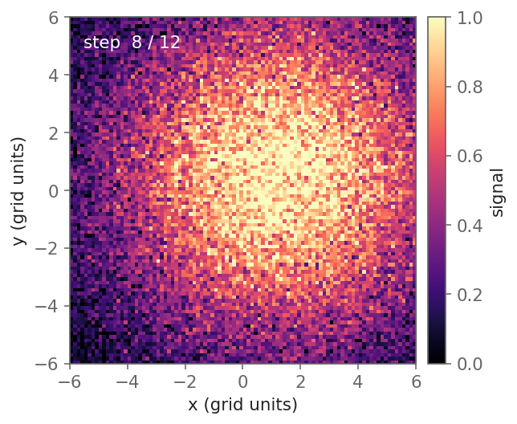{width="215px"}
:::
::::

:::: {.media-row}
::: {.media-label}
Method B:
:::
::: {.media-items}
{width="215px"} {width="215px"} 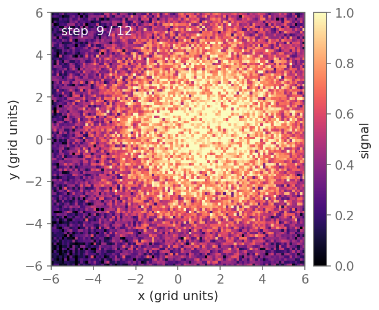{width="215px"}
:::
::::

::::::

::: {.caption-line}
Two `.media-row`s, not a table: every panel keeps its own aspect ratio, and the
wrapper sets `--label-width` once so the labels line up whatever they say.
:::

## Anywhere on the slide

`.absolute` plus `top`/`left`/`bottom`/`right` puts an element at a fixed spot
in the 1280 &times; 720 coordinate space — for an inset, a callout, or a label
that has to land on a particular feature.

{.absolute bottom="70" left="120" width="180"}

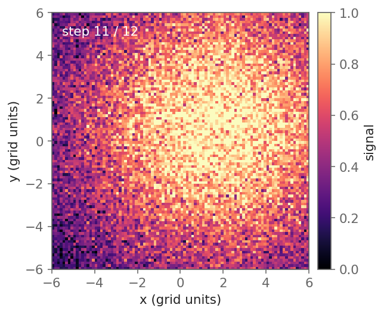{.absolute top="200" right="120" width="180"}

::: {.absolute .center style="left:50%; top:58%; transform:translate(-50%,-50%); width:360px;"}
[`left:50%` with `translate(-50%,-50%)` centres a box at any width, with no
arithmetic.]{.small}
:::

## A flip-book, in place

`.r-stack` piles its children on one spot; wrap each in a fragment and they
advance one at a time, in the same frame, with nothing else on the slide moving.

::: {.r-stack}
{height="300px"}

::: {.fragment .fade-in-then-out}
{height="300px"}
:::
::: {.fragment .fade-in-then-out}
{height="300px"}
:::
::: {.fragment .fade-in-then-out}
{height="300px"}
:::
::: {.fragment .fade-in-then-out}
{height="300px"}
:::
::: {.fragment .fade-in-then-out}
{height="300px"}
:::
::: {.fragment .fade-in-then-out}
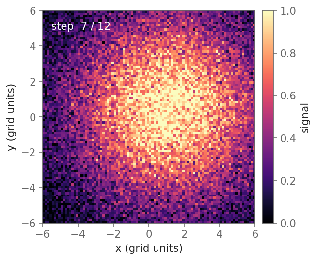{height="300px"}
:::
::: {.fragment .fade-in-then-out}
{height="300px"}
:::
::: {.fragment .fade-in-then-out}
{height="300px"}
:::
::: {.fragment .fade-in-then-out}
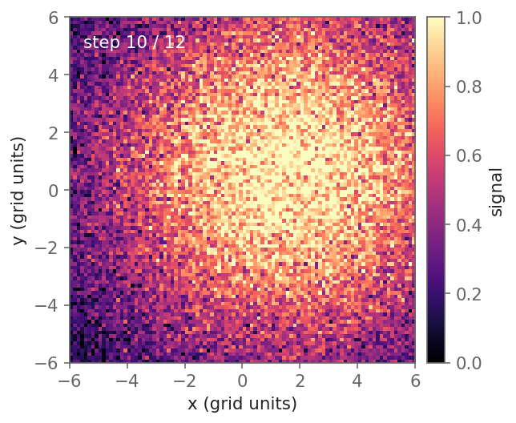{height="300px"}
:::
::: {.fragment .fade-in-then-out}
{height="300px"}
:::
::: {.fragment .fade-in-then-out}
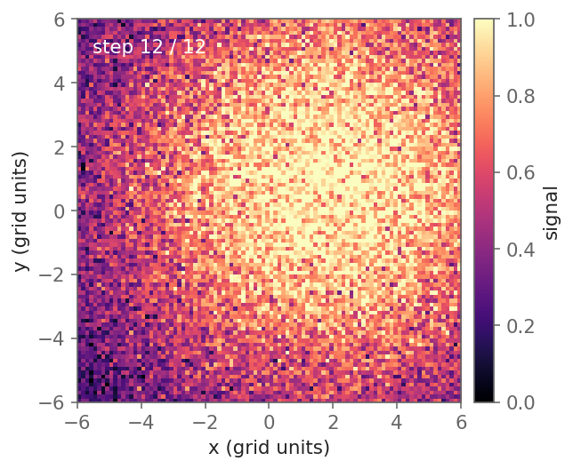{height="300px"}
:::
:::

::: {.caption-line}
This is the only animation that survives the PDF: `make pdf` gives each fragment
its own page, so the twelve frames come out as twelve pages you can hold an
arrow key down through. A `<video>` on the next slide prints as one still.
:::

# Motion

## Video

The deck *is* a browser, so a video is a video — no frame extraction, no
flip-book, no player to install.

:::: {.columns-3-2}

::: {.column}
```html
<video class="r-stretch video-center"
       src="attach/spread.mp4"
       controls data-autoplay muted loop>
</video>
```

- `data-autoplay` starts it when the slide arrives, and rewinds it on the way out
- `controls` gives a scrub bar for questions
- `muted` is what browsers require before they will autoplay anything
- `r-stretch` sizes it to whatever height the slide has left

::: {.small .muted}
In the PDF this prints as one still frame — a page cannot play anything. When
the animation has to survive on paper too, use the flip-book instead.
:::
:::

::: {.column}
<video src="attach/spread.mp4" style="height: 300px; display: block; margin: 0 auto;" controls data-autoplay muted loop></video>

::: {.caption-line}
The signal spreading, twelve steps
:::
:::

::::

## Two clips on one timeline

::: {.video-pair style="width: 900px"}
<video src="attach/spread.mp4" style="flex: 644" controls data-autoplay muted loop></video>
<video src="attach/curve.mp4" style="flex: 814" controls data-autoplay muted loop></video>
:::

::: {.caption-line}
`flex: 644` and `flex: 814` are the two clips' pixel widths, so the pair keeps
its native relative scale. The row's own `width` is what stops the taller clip
from running off the bottom — set it, then let `make check` confirm.
:::

## A GIF

A GIF is an image, so it needs no player and no attributes — but it also cannot
be paused, scrubbed or muted. Prefer mp4 for anything you might want to stop and
talk over.

::: {.fig}
{height="300px"}

[Author 2026]{.credit}
:::

## Auto-animate {auto-animate="true" auto-animate-easing="ease-in-out"}

Two consecutive slides with `{auto-animate="true"}`. Reveal matches elements by
`data-id` and tweens whatever differs between them — size, position, margin.

{data-id="anim" width="260px"}

Useful for growing a figure you have just discussed, or moving it aside to make
room for the next thing.

## Auto-animate {auto-animate="true" auto-animate-easing="ease-in-out"}

:::: {.columns}

::: {.column}
{data-id="anim" width="500px"}
:::

::: {.column}
::: {.fragment .fade-left}
The same image, one `data-id`, two slides. Nothing was re-declared: only the
width changed.
:::

::: {.fragment .fade-left}
In the PDF the two slides print as two pages, so the before and after both
survive on paper.
:::
:::

::::

# Maths and diagrams

## Maths

Inline: the equation $E = mc^2$ sets in the surrounding text.

Display:

$$
\sigma^2(t) = \frac{1}{N}\sum_{i=1}^{N}\left(x_i(t) - \bar{x}(t)\right)^2
$$

Aligned:

$$
\begin{aligned}
\frac{\partial u}{\partial t} &= D\,\nabla^2 u \\
w(t) &= \sqrt{2 D t} \;\approx\; \color{red}{0.42\,t} + w_0
\end{aligned}
$$

[Colour part of an equation with `\color{red}{..}` — never `\textcolor`, which
the web maths renderer does not define.]{.small .muted}

## Maths that builds up

`\class{fragment}{..}` inside the maths makes a term arrive on its own
keypress, so an equation can be read one piece at a time.

$$
\underbrace{\frac{\partial u}{\partial t}}_{\text{change in time}}
\class{fragment}{= \underbrace{D\,\nabla^2 u}_{\text{spreading}}}
\class{fragment}{\;+\; \underbrace{s(x,t)}_{\text{source}}}
$$

. . .

Each step costs a keypress and nothing at all in the file — the whole equation
is still one slide.

## Diagrams

[Mermaid](https://mermaid.js.org/) is built in: write the graph, get an SVG that
scales with the slide and prints sharp.

:::: {.columns}

::: {.column}
````markdown
```{{mermaid}}
flowchart TD
  A[Collect] --> B{Above
                  threshold?}
  B -->|Yes| C[Measure width]
  B -->|No| D[Discard]
  C --> E[Report]
  D --> E
```
````
:::

::: {.column}
```{mermaid}
%%| fig-height: 3.2
flowchart TD
  A[Collect] --> B{Above threshold?}
  B -->|Yes| C[Measure width]
  B -->|No| D[Discard]
  C --> E[Report]
  D --> E
```
:::

::::

# Finishing

## Citations

Declare `bibliography: ref.bib` in the YAML, then cite in Pandoc's syntax:

- Narrative — `@Knuth1984 argued that` → @Knuth1984 argued that a program should
  be written for a person to read
- Parenthetical — `[e.g., @Wilson2014; @Tufte1983]` → the same applies to the
  code behind a figure [e.g., @Wilson2014; @Tufte1983]
- `csl: some-journal.csl` in the YAML switches to a journal's own style

::: {.highlight}
If you cite anything, add a References slide. Without one Pandoc drops the
bibliography outside every `<section>`, and reveal.js then paints it over every
slide in the deck.
:::

## References

::: {#refs}
:::

## Thanks! {.focus .center background-color="var(--deck-primary)"}

Now go and write one

`cp -r template talks/my-talk`
