## Reference

:::: {.columns}

::: {.column}
**Structure**

- `#` section, `##` slide, `---` another slide
- `{.class}` and `{key="value"}` on any heading
- `::: {.class}` … `:::` around any block

**Layout classes**

- `.columns` (50/50), `.columns-2-1`, `.columns-3-2`, `.columns-1-1-1`
- `.fig` + `.caption` / `.credit` / `.below`
- `.media-row` + `.media-label` / `.media-items`
- `.highlight`, `.alert`, `.small`, `.tiny`, `.center`, `.muted`
:::

::: {.column}
**Reveal's own**

- `.incremental`, `.fragment`, `. . .`
- `.absolute`, `.r-stack`, `.r-stretch`
- `{auto-animate="true"}` on two slides in a row
- `{background-color=".."}`, `{background-image=".."}`

**Presenting**

- **S** speaker view · **F** fullscreen · **O** overview
- **B** blank · **G** jump to slide · **M** menu · `?` keys
- **X** the 1280 &times; 720 boundary, while you write
- `#/7` in the URL jumps to slide 7
:::

::::

::: {.caption-line}
Everything below, at a glance. The rest of the deck is these, one at a time.
:::

# Getting started

## Quick start

This deck is four files. `_quarto.yml` holds every option that shapes the whole
deck, `theme.scss` holds the look, `fonts.html` ships the typeface, and
`demo.qmd` — this file — holds the slides.

#### Live preview

```bash
make preview          # a browser that reloads as you save
make                  # render once to out/demo.html
```

`make preview` needs nothing but Quarto, so it still works in a deck copied
anywhere, years from now.

## Exporting

:::: {.columns}

::: {.column}
**What you get**

- `out/demo.html` — the deck, plus its assets beside it
- `out/demo-standalone.html` — the same, in one file you can email
- `out/demo.pdf` — **one page per step**: the deck as presented
- `out/demo-one-page-per-slide.pdf` — fully built, for reading
- `out/demo.pptx` — PowerPoint, re-flowed by Pandoc
:::

::: {.column}
**Commands**

```bash
make            # html
make all        # html + pdf + pptx
make standalone
make check      # look at every slide
make png        # one PNG per slide
```
:::

::::

PowerPoint gets the Markdown, not the reveal.js layout — treat PPTX as a
delivery format, not a source format.

## The rules of the file

- **New section** — a `#` heading, which becomes a divider slide
- **New slide** — a `##` heading, set by `slide-level: 2`
- **Another slide, same title** — a bare `---`
- **Global options** — `_quarto.yml`; this talk's title and footer, the YAML at
  the top of this file
- **Custom layout** — a class on the heading, or a fenced div in the body

```markdown
## A slide with no chrome {.no-chrome}
## One big statement {.focus .center background-color="#0a6ebd"}
::: {.columns-2-1} ::: {.column} … ::: ::: {.column} … ::: :::
```

## What is Quarto?

**Quarto** renders Markdown to a [reveal.js](https://revealjs.com/)
presentation: a real web page, driven by the arrow keys.

- Version-controls as cleanly as any text file, and the markup is plain Markdown
- The theme is SCSS, so anything CSS can do, the deck can do
- Video, GIFs and live web content work because it *is* a browser
- Speaker view, a timer and a slide menu come for free

. . .

- ...and `. . .` reveals the rest of a slide on the next keypress

::: notes
Speaker notes live in a `::: notes` block beside the slide they belong to. Press
**S** during the talk for the presenter window: notes, a timer, and the next
slide.
:::

## Reveals, one step at a time

:::: {.columns}

::: {.column}
**A list, item by item**

::: {.incremental}
- First this
- then this
- then this.
:::
:::

::: {.column}
**Anything, as a fragment**

::: {.fragment .fade-in}
`.fade-in` — arrives quietly
:::

::: {.fragment .highlight-red}
`.highlight-red` — turns red
:::

::: {.fragment .strike}
`.strike` — gets crossed out
:::
:::

::::

Unlike the Typst deck, a reveal costs no extra page: fragments live inside one
slide and only the PDF spends paper on them.

# Text, code and tables

## Lists and formatting

:::: {.columns}

::: {.column}
- Ordinary Markdown
  - `**Bold text**` for emphasis
  - `*Italic text*` for subtle emphasis
  - `` `Inline code` `` for technical terms
- `[..]{.alert}` paints text in the theme's accent colour, like
  [this]{.alert}
:::

::: {.column}
**Nested lists**

- Main point 1
  - Sub-point A
  - Sub-point B
- Main point 2
  - Sub-point C
  - Sub-point D
:::

::::

::: {.highlight}
`::: {.highlight}` is the callout for the one sentence a slide is really about.
:::

## Code highlighting

```python
def hello_world():
    print("Hello, Quarto!")
    return True

if __name__ == "__main__":
    hello_world()
```

Fenced blocks are highlighted by Quarto at render time, with no JavaScript
involved. `highlight-style: github` in `_quarto.yml` picks the palette.

## Code that walks itself

Give the fence a `code-line-numbers` and each keypress moves the highlight:

```` markdown
``` {.python code-line-numbers="1-2|4|6"}
```
````

``` {.python code-line-numbers="1-2|4|6"}
def compute(x, y):
    z = x + y

    result = z * 2

    return result
```

## Blockquotes and links

> The best way to predict the future is to invent it.
>
> <cite>Alan Kay</cite>

- [Quarto](https://quarto.org/)
- [Quarto reveal.js presentations](https://quarto.org/docs/presentations/revealjs/)
- [reveal.js](https://revealjs.com/)

## Tables

:::: {.columns}

::: {.column}
**With a header row**

| Method | Advantages | Disadvantages |
|---|---|---|
| Method A | Fast, simple | Less accurate |
| Method B | Accurate | Slow, complex |
| Method C | Balanced | Moderate |
:::

::: {.column}
**Headerless**

::: {.no-header}
| | | |
|---|---|---|
| Data A | Data B | Data C |
| 1.23 | 4.56 | 7.89 |
| 2.34 | 5.67 | 8.90 |
| 3.45 | 6.78 | 9.01 |
:::
:::

::::

`::: {.no-header}` hides the header row, for a table that is really a grid.

# Figures

## One figure with a source credit

Every figure in a talk needs to say where it came from. `.fig` shrink-wraps the
image, so the credit sits tight against the image's own bottom-right corner
rather than the slide's.

:::: {.columns}

::: {.column}
````markdown
::: {.fig}
{width="300px"}

[He et al. 2025]{.credit}
:::
````

[Size images inside `.fig` in `px` or `pt`. A percentage has nothing to resolve
against inside a box that is sizing itself to its contents.]{.small .muted}
:::

::: {.column}
::: {.fig}
{width="270px"}

[He et al. 2025]{.credit}
:::
:::

::::

## Caption above, a label below, or both

`.caption` goes above the figure — the house default, since a slide is read top
to bottom. `.below` is the exception, for the second half of a paired label.
Both are optional, and so is the credit.

:::: {.columns-1-1-1}

::: {.column}
::: {.fig}
[Above the figure]{.caption}

{width="230px"}

[Smith 2024]{.credit}
:::
:::

::: {.column}
::: {.fig}
{width="230px"}

[Lee & Park 2023]{.credit}

[Below the figure]{.below}
:::
:::

::: {.column}
::: {.fig}
[Setup]{.caption}

{width="230px"}

[He et al. 2025]{.credit}

[Result]{.below}
:::
:::

::::

## A row of figures

:::: {.media-row}
::: {.media-label}
Image 1:
:::
::: {.media-items}
{width="385px"} {width="385px"} {width="385px"}
:::
::::

<!-- 371 and 810 are 820 and 1788 — the two files' own pixel widths — at one
     common scale factor, so the pair fills the row and still shows the two
     figures at their true size relative to each other. -->
:::: {.media-row}
::: {.media-label}
Image 2:
:::
::: {.media-items}
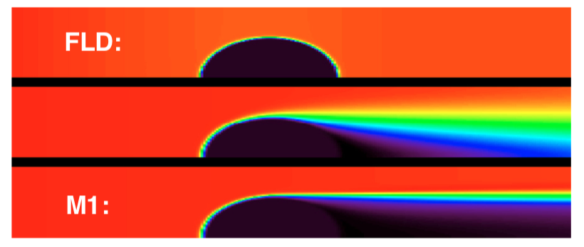{width="371px"} 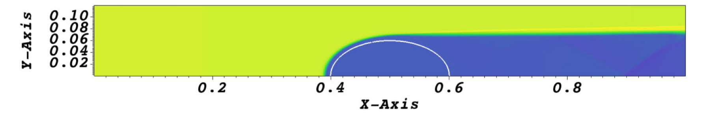{width="810px"}
:::
::::

::: {.caption-line}
A width or a height, never both — `make check` fails any figure drawn more than
2% off its file's own shape.
:::

## Figure beside text

:::: {.columns-3-2}

::: {.column}
Marp docks a background image with ``. Here you compose the
slide instead:

- `::: {.columns-3-2}` splits the page
- the image is an ordinary Markdown image in the right column
- any ratio works: `.columns-1-1`, `.columns-2-1`, `.columns-1-1-1`

The figure takes part in the layout rather than floating behind it, so text
never collides with it.
:::

::: {.column}
{width="330px"}
:::

::::

## A grid of figures

::::::: {style="--label-width: 250px"}

:::: {.media-row}
::: {.media-label}
Exact Eddington tensor:
:::
::: {.media-items}
{width="334px"} {width="334px"} {width="334px"}
:::
::::

:::: {.media-row}
::: {.media-label}
M1 closure:
:::
::: {.media-items}
{width="334px"} {width="334px"} {width="334px"}
:::
::::

:::: {.media-row}
::: {.media-label}
FLD:
:::
::: {.media-items}
{width="334px"} {width="334px"} {width="334px"}
:::
::::

:::::::

::: {.caption-line}
Time evolution under three radiation transport methods. Three `.media-row`s, not
a table: every panel keeps its own aspect ratio, and the wrapper sets
`--label-width` once to line the labels up.
:::

## Anywhere on the slide

`.absolute` plus `top`/`left`/`bottom`/`right` puts an element at a fixed spot
in the 1280 &times; 720 coordinate space — for an inset, a callout, or a label
that has to land on a particular feature.

{.absolute bottom="90" left="120" width="200"}

{.absolute top="220" right="120" width="150"}

::: {.absolute .center style="left:50%; top:62%; transform:translate(-50%,-50%); width:360px; background:#eef5fa; border-left:4px solid #2e97db; padding:0.5em;"}
[`left:50%` with `translate(-50%,-50%)` centres a box at any width, with no
arithmetic.]{.small}
:::

## A flip-book, in place

`.r-stack` piles its children on one spot; wrap each in a fragment and they
advance one at a time, in the same frame, with nothing else on the slide moving.
Twelve frames of the clip two slides on, as a sequence of images.

::: {.r-stack}
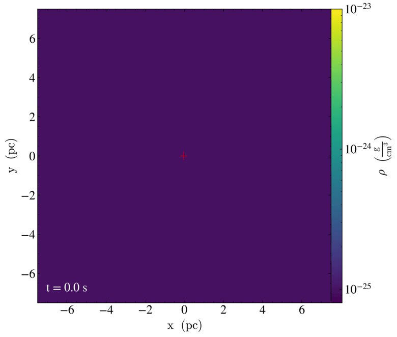{height="320px"}

::: {.fragment .fade-in-then-out}
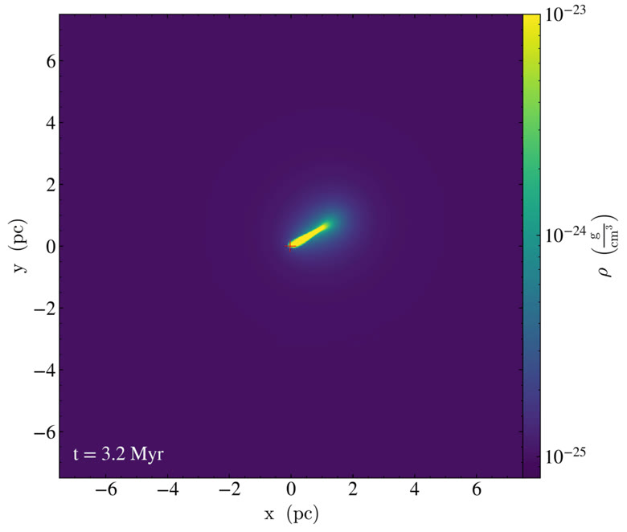{height="320px"}
:::
::: {.fragment .fade-in-then-out}
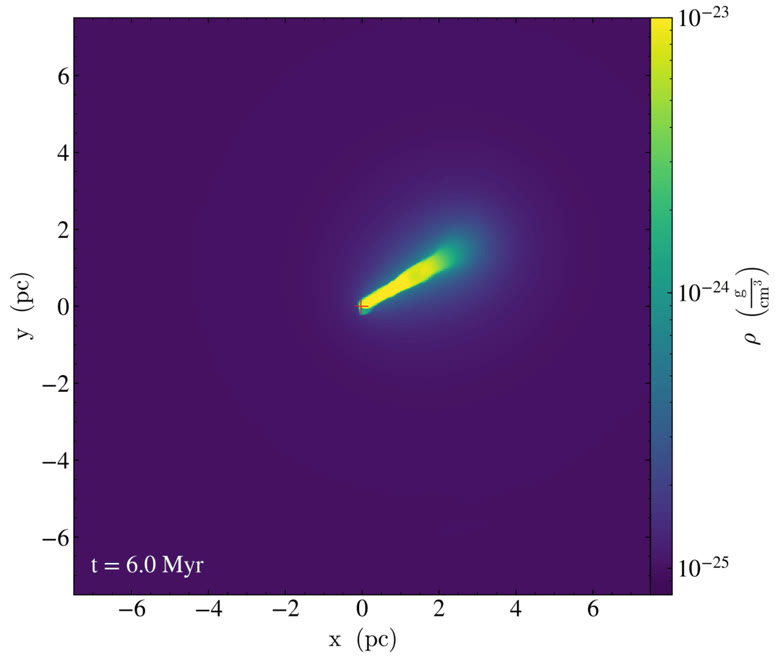{height="320px"}
:::
::: {.fragment .fade-in-then-out}
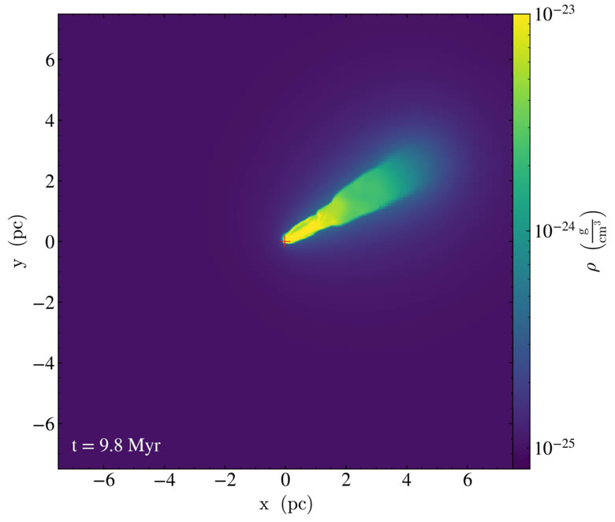{height="320px"}
:::
::: {.fragment .fade-in-then-out}
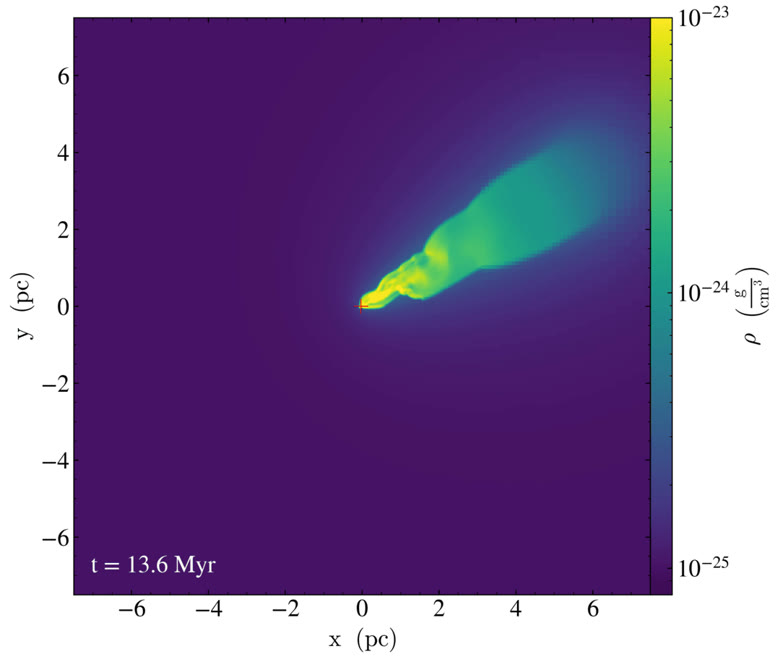{height="320px"}
:::
::: {.fragment .fade-in-then-out}
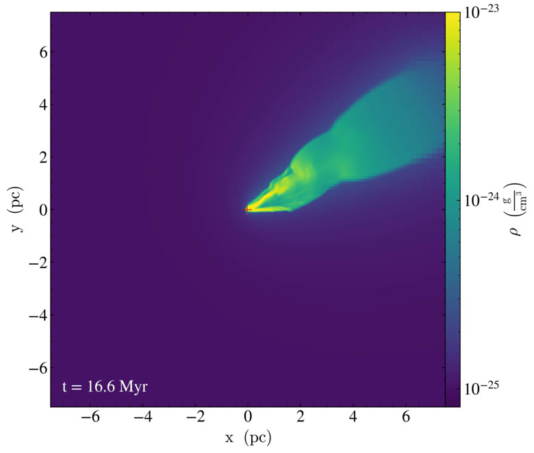{height="320px"}
:::
::: {.fragment .fade-in-then-out}
{height="320px"}
:::
::: {.fragment .fade-in-then-out}
{height="320px"}
:::
::: {.fragment .fade-in-then-out}
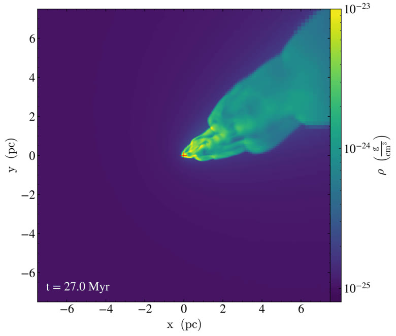{height="320px"}
:::
::: {.fragment .fade-in-then-out}
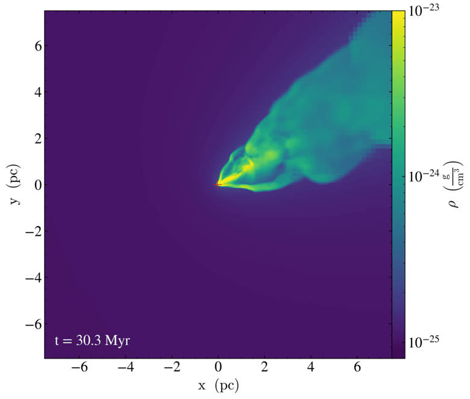{height="320px"}
:::
::: {.fragment .fade-in-then-out}
{height="320px"}
:::
::: {.fragment .fade-in-then-out}
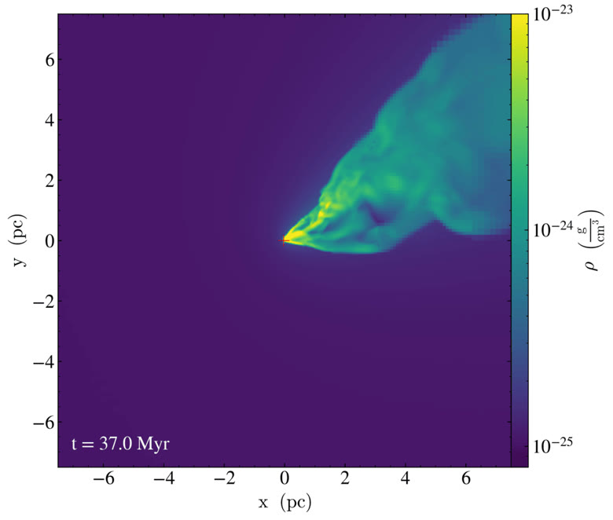{height="320px"}
:::
:::

::: {.caption-line}
This is the only animation that survives the PDF: `make pdf` gives each fragment
its own page, so the twelve frames come out as twelve pages you can hold an
arrow key down through. A `<video>` on the next slide prints as one still.
:::

# Video

## Video

The Typst deck samples a folder of frames into a PDF flip-book because PDF
cannot do better. Here the deck *is* a browser, so a video is a video.

:::: {.columns-3-2}

::: {.column}
```html
<video class="r-stretch video-center"
       src="attach/bh-zoom.mp4"
       controls data-autoplay muted loop>
</video>
```

- `data-autoplay` starts it when the slide arrives, and rewinds it on the way out
- `controls` gives a scrub bar for questions
- `muted` is what browsers require before they will autoplay anything
- `r-stretch` sizes it to whatever height the slide has left

::: {.small .muted}
In the PDF this prints as one still frame — a page cannot play anything. When
the animation has to survive on paper too, use the flip-book instead.
:::
:::

::: {.column}
<video src="attach/bh-zoom.mp4" style="height: 330px; display: block; margin: 0 auto;" controls data-autoplay muted loop></video>

::: {.caption-line}
Gas density around an accreting black hole
:::
:::

::::

## Two clips on one timeline

::: {.video-pair style="width: 800px"}
<video src="attach/bh-zoom.mp4" style="flex: 1080" controls data-autoplay muted loop></video>
<video src="attach/bh-mdot.mp4" style="flex: 720" controls data-autoplay muted loop></video>
:::

::: {.caption-line}
`flex: 1080` and `flex: 720` are the two clips' pixel widths, so the pair keeps
its native relative scale. The row's own `width` is what stops the taller clip
from running off the bottom — set it, then let `make check` confirm.
:::

## A GIF

A GIF is an image, so it needs no player and no attributes — but it also cannot
be paused, scrubbed or muted. Prefer mp4 for anything you might want to stop
and talk over.

::: {.fig}
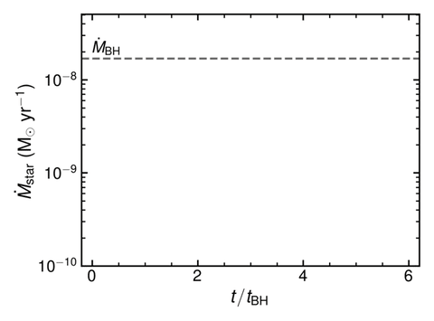{height="330px"}

[He et al. 2025]{.credit}
:::

## Auto-animate {auto-animate="true" auto-animate-easing="ease-in-out"}

Two consecutive slides with `{auto-animate="true"}`. Reveal matches elements by
`data-id` and tweens whatever differs between them — size, position, margin.

{data-id="anim" width="180px"}

Useful for growing a figure you have just discussed, or moving it aside to make
room for the next thing.

## Auto-animate {auto-animate="true" auto-animate-easing="ease-in-out"}

:::: {.columns}

::: {.column}
{data-id="anim" width="420px"}
:::

::: {.column}
::: {.fragment .fade-left}
The same image, one `data-id`, two slides. Nothing was re-declared: only the
width changed.
:::

::: {.fragment .fade-left}
In the PDF the two slides print as two pages, so the before and after both
survive on paper.
:::
:::

::::

# Math and diagrams

## Math

Inline: the equation $E = mc^2$ sets in the surrounding text.

Display:

$$
\frac{\partial E}{\partial t} + \nabla \cdot \boldsymbol{F}
  = \color{red}{4\pi \rho j} - \rho \kappa c E
$$

Aligned:

$$
\begin{aligned}
\frac{\partial E_\nu}{\partial t} + \nabla \cdot \boldsymbol{F}_\nu
  &= 4\pi \rho j_\nu - \rho \kappa_{\nu,a} c E_\nu \\
\frac{1}{c}\frac{\partial \boldsymbol{F}_\nu}{\partial t} + c \nabla \cdot \mathbb{P}_\nu
  &= -\rho \kappa_{\nu,a} \boldsymbol{F}_\nu
\end{aligned}
$$

[Colour part of an equation with `\color{red}{..}` — never `\textcolor`, which
the web maths renderer does not define.]{.small .muted}

## Math that builds up

`\class{fragment}{..}` inside the maths makes a term arrive on its own
keypress, so an equation can be read one piece at a time.

$$
\underbrace{\frac{1}{c}\frac{\partial \boldsymbol{F}}{\partial t}}_{\text{time dependence}}
\class{fragment}{+ \underbrace{c \nabla \cdot \mathbb{P}}_{\text{transport}}}
\class{fragment}{= \underbrace{-\rho \kappa_a \boldsymbol{F}}_{\text{absorption}}}
$$

. . .

Each step costs a keypress and nothing at all in the file — the whole equation
is still one slide.

## Diagrams

Typst draws diagrams with `fletcher`. Quarto has
[Mermaid](https://mermaid.js.org/) built in: write the graph, get an SVG.

:::: {.columns}

::: {.column}
````markdown
```{{mermaid}}
flowchart TD
  A[Start] --> B{Decision?}
  B -->|Yes| C[Process 1]
  B -->|No| D[Process 2]
  C --> E[End]
  D --> E
```
````
:::

::: {.column}
```{mermaid}
%%| fig-height: 3.2
flowchart TD
  A[Start] --> B{Decision?}
  B -->|Yes| C[Process 1]
  B -->|No| D[Process 2]
  C --> E[End]
  D --> E
```
:::

::::

# Wrapping up

## Citations

Declare `bibliography: ref.bib` in the YAML, then cite in Pandoc's syntax:

- Narrative — `@Rosdahl2013 implemented RAMSES-RT` → @Rosdahl2013 implemented
  RAMSES-RT
- Parenthetical — `[e.g., @Rosdahl2013; @Kannan2019]` → M1 closure methods
  [e.g., @Rosdahl2013; @Kannan2019]
- `csl: mnras.csl` in the YAML switches to a journal's own style

::: {.highlight}
If you cite anything, add a References slide. Without one Pandoc drops the
bibliography outside every `<section>`, and reveal.js then paints it over every
slide in the deck.
:::

## References

::: {#refs}
:::

## Thanks! {.focus .center}

Questions? Comments? Feedback welcome!

your.email\@university.edu
